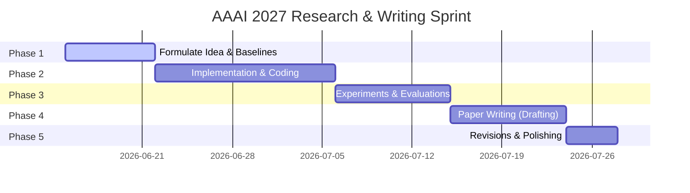

# AAAI 2027 Submission Timeline & Research Plan
**Target Field:** Knowledge Graphs (KG) / Graph-RAG / Temporal KGs / Inductive KGC  
**Timeline:** June 15, 2026 – July 28, 2026 (6 Weeks / 43 Days)

---

## 1. Timeline Overview (6-Week Sprint)

---

## 2. Phase-by-Phase Plan

### Phase 1: Problem Definition, Concept & Baselines (June 15 – June 22)
*Goal: Finalize a novel, narrow thesis and select 2–3 SOTA baselines.*

1. **Leverage the 37 AAAI Papers:**
   * Review the [research_summaries.md](file:///C:/Users/seast/.gemini/antigravity/brain/64dcc89e-5814-4b7d-b1dc-b7f82d304c94/research_summaries.md) to locate the current SOTA frontier.
   * **Promising Hot Sub-fields:**
     * **Graph-RAG Efficiency:** E.g., community-based reasoning (*FastToG*) or progressive reasoning (*ProgRAG*). Can you make it even faster, cheaper, or run on smaller open-source LLMs?
     * **Uncertainty & Factuality in KGQA:** E.g., conformal prediction (*UAG*) or entropy-based arbitration (*TruthfulRAG*).
     * **Multi-Modal / Mixed-Curvature KGs:** E.g., projection geometries (*5EL* or *MCKGC*).
2. **Formulate a Core Hypothesis:** 
   * Propose a simple plug-and-play modification to a SOTA baseline. *Do not try to build a massive framework from scratch; time is too short.*
3. **Set Up the Code Environment:** 
   * Obtain the source code of your target baseline (e.g., download ToG, APST, or NBFNet repositories).
   * Prepare the datasets (e.g., WebQSP, CWQ, FB15k-237, WN18RR).

---

### Phase 2: Implementation & Iteration (June 22 – July 6)
*Goal: Code the proposed method and verify it works on a small subset of data.*

1. **Build the Prototype:**
   * Write your modules (e.g., custom attention, dynamic filtering, or prompt adapter).
   * Integrate it with the baseline model's training/evaluation pipeline.
2. **Verify Correctness:**
   * Run debugging tests on 5%–10% of the dataset to ensure no syntax/runtime issues, and check if the initial results show a positive trend.
3. **Prepare Baseline Reproductions:**
   * Run the baseline code on your environment to obtain local performance figures for a fair comparison.

---

### Phase 3: Scaling Experiments & Evaluation (July 6 – July 15)
*Goal: Run full-scale training and evaluation, produce figures, and build ablation studies.*

1. **Run Full Evaluation:**
   * Run your model on complete datasets (e.g., Hits@k, MRR, Accuracy).
2. **Ablation Studies:**
   * Individually disable your proposed modules/heuristics to prove their contribution (Crucial for AAAI reviewers).
3. **Hyperparameter Analysis:**
   * Plot performance variation over different parameters (e.g., beam width, embedding size, temperature).
4. **Export Visuals:**
   * Create clean, publication-ready vector plots (using `matplotlib` or `seaborn`) and tables.

---

### Phase 4: Structured Paper Writing (July 15 – July 24)
*Goal: Draft the full 8-page paper (plus references) in LaTeX using the AAAI template.*

* **Day 1–2 (Technical Core):** Write **Section 4: Methodology**. Explain your model precisely with formal notation and a system architecture diagram.
* **Day 3–4 (Empirical Proof):** Write **Section 5: Experiments**. Populate the results table, describe the setup, datasets, baselines, and analyze the ablation studies.
* **Day 5–6 (Introduction & Setup):** Write **Section 1: Introduction** (outline the hook, limitations of current work, and your three contributions) and **Section 3: Problem Formulation**.
* **Day 7–8 (Context & Wrap-up):** Write **Section 2: Related Work** and **Section 6: Conclusion**.
* **Day 9:** Write the **Abstract** and refine the Title.

---

### Phase 5: Polishing, Review, and Submission (July 24 – July 28)
*Goal: Co-author review, proofreading, and meeting AAAI technical guidelines.*

1. **Technical Check:** Ensure the paper complies with the AAAI formatting instructions (margins, font, page limit - usually 7 pages content + 1 page references, or 8 pages total depending on the call).
2. **Readability Pass:** Check for clarity, flow, math notation consistency, and figure captions.
3. **Anonymization:** Double-check that all author names, affiliations, and git repo links are fully anonymized for double-blind review.
4. **Submit Early:** Register the paper on CMT/OpenReview and upload the abstract/PDF at least 24 hours before the July 28 deadline to avoid server overload.

---

## 3. Immediate Next Steps (This Week)
1. **Choose your exact niche:** Select 3-4 papers from the [research_summaries.md](file:///C:/Users/seast/.gemini/antigravity/brain/64dcc89e-5814-4b7d-b1dc-b7f82d304c94/research_summaries.md) that catch your eye.
2. **Formulate a specific question:** What is the exact problem you want to address? (e.g., "Improving KG-RAG latency by doing X" or "Reducing halluncination in Multi-hop QA by doing Y").
3. **Check out the AAAI 2027 call for papers website** to confirm the exact page limit and formatting guidelines.
