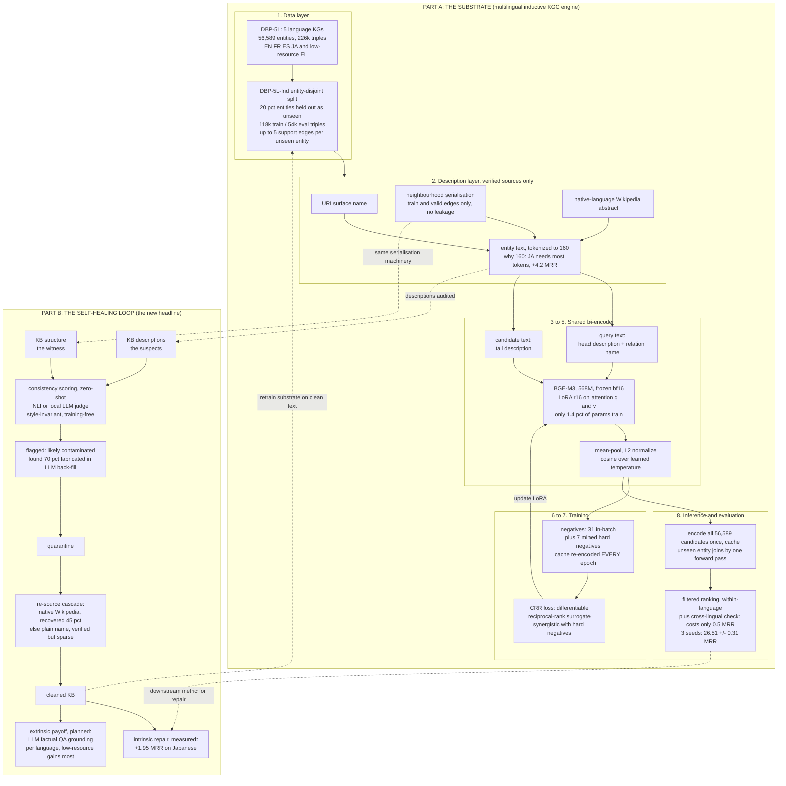
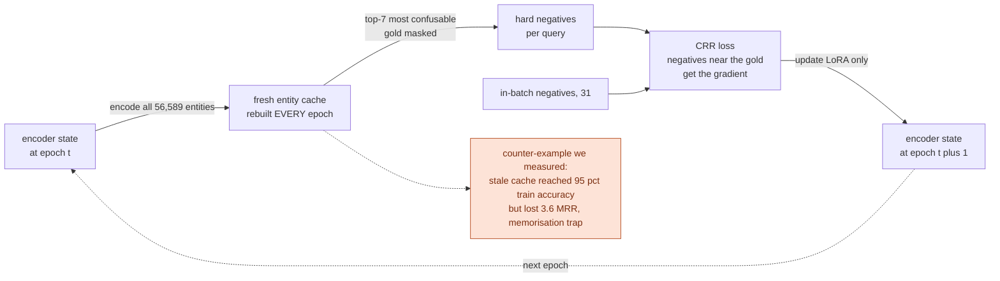

# Full Architecture, In Depth: Every Component and Why It Is There

**Written 2026-07-06.** This is the deep technical companion to `PROJECT_STORY_AND_PLAN.md`.
It describes the entire system behind the current story and plan, layer by layer, and for every
component answers three questions: what it is, why we chose it, and what evidence backs the
choice. Wherever possible the "why" is backed by our own measured numbers, because almost every
design decision in this project was tested rather than assumed.

The system has two halves:
- **Part A, the substrate:** the multilingual inductive KG completion engine (the original
  project). It is the retriever, the completion model, and the evaluation harness.
- **Part B, the new layer:** the self-healing loop (detect contaminated descriptions with the
  graph's own structure, quarantine, re-source, measure the repair downstream), which is the
  headline of the fused research direction.

Style: no shorthand dashes, no emojis.

---

## Table of contents

0. System diagrams (the whole architecture at a glance)
1. Part A: the data layer (DBP-5L and the DBP-5L-Ind split)
2. Part A: the description layer (what text each entity carries)
3. Part A: the encoder (why BGE-M3)
4. Part A: the fine-tuning method (why LoRA, and why rank 16 on attention)
5. Part A: the bi-encoder design (shared tower, pooling, scoring)
6. Part A: the training objective (why CRR loss)
7. Part A: negative sampling (why mined hard negatives, and why fresh)
8. Part A: the evaluation protocol (filtered, within-language, and the two bugs that shaped it)
9. Part A: systems engineering for one 16 GB GPU
10. Part B: the contamination detector (structure judges text)
11. Part B: quarantine and re-sourcing
12. Part B: repair measurement and the grounding payoff
13. End-to-end data flow
14. The decision table: every major choice, the alternative, and the evidence
15. What we deliberately did NOT use, and why

---

## 0. System diagrams

Two diagrams, both in Mermaid so they render directly in VS Code preview and GitHub. Diagram 1
is the whole system; Diagram 2 zooms into the training cycle whose freshness property we
measured to be critical. There is also an interactive, publication-styled figure of Part A at
`docs/figures/dbp5l-ind-architecture.html` (open in any browser; hover the results bars for
per-run details).

### Diagram 1: the whole system



Reading guide for Diagram 1: solid arrows are the data flow; dotted arrows are the four
connections that make the two halves one project. Part B audits exactly the description layer
that Part A consumes, reuses Part A's neighbourhood serialisation as the witness, and uses
Part A's evaluation as the downstream repair metric.

### Diagram 2: the training cycle and why freshness matters



Reading guide for Diagram 2: the cycle is self-referential on purpose (the model mines its own
negatives from its own current embeddings), and the boxed warning is the measured failure mode
that justifies the design: if the cache lags the model, training accuracy soars while real
ranking quality falls.

---

## 1. Part A: the data layer

**What.** DBP-5L: five language-specific knowledge graphs extracted from DBpedia (English,
French, Spanish, Japanese, Greek), 56,589 entities, 1,392 relations, about 226k triples, with
alignment links connecting roughly 40 percent of entities across languages. On top of it we
built DBP-5L-Ind, our entity-disjoint inductive split.

**Why DBP-5L and not another multilingual KG.** Three reasons, decided early and documented in
`design/dataset_choice.md`:
1. It contains a genuine low-resource language. Greek has 5,231 entities and 13,839 triples,
   about one sixth of English. A low-resource column is where every claim about multilinguality
   gets tested. The alternative (the Wikidata5M multilingual extension used by KL-GMoE) contains
   only high-resource languages.
2. It has separate per-language graphs plus cross-lingual alignment links, so statements like "a
   fact exists in English but is missing in Greek" are literally expressible in the data.
3. It is the canonical benchmark of the multilingual KGC literature (KEnS, AlignKGC, SS-AGA,
   JMAC all use it), which gives us published transductive numbers to calibrate against, and it
   fits a 16 GB GPU, which a 3 million triple dataset would not.

**Why an entity-disjoint split (the "Ind" in DBP-5L-Ind).** The inductive setting requires test
entities the model has never seen. We hold out 20 percent of entities per language entirely from
training: no triple containing them is trained on. Evaluation triples must touch at least one
held-out entity. This is the same construction paradigm BLP (WWW 2021) used for English, applied
for the first time to a multilingual KG. Why 20 percent and why only entities with at least 3
triples: holding out an entity is only meaningful if some of its facts remain to be predicted and
a few can serve as held-aside context (support edges, up to 5 per unseen entity, never used as
training signal and always filtered at evaluation). Everything is generated with a fixed seed
and a documented protocol so the split is exactly reproducible.

**Why this matters to the new story.** The split gives us two things Part B needs: a controlled
population of unseen entities (the hardest case for both completion and contamination, since new
entities are exactly the ones whose descriptions get auto-generated), and a downstream task on
which repair can be measured.

---

## 2. Part A: the description layer

**What.** Every entity carries a text description assembled from verified sources:
1. Its surface name, decoded from the DBpedia URI (always available).
2. A serialisation of its graph neighbourhood: "name | relation1: neighbour1, neighbour2 |
   relation2: neighbour3", built only from training and validation edges.
3. A native-language Wikipedia or DBpedia abstract where one exists.

**Why descriptions at all.** The entire inductive mechanism rests on them. A transductive model
represents an entity by a learned vector, which does not exist for an unseen entity. A text
model represents an entity by encoding its description, so a brand-new entity is usable the
moment it has text. Our own ablation shows how decisive this is: with names only the model
scored 0.41 MRR; adding neighbourhood text and relation names brought it to 3.1; adding
Wikipedia abstracts took it to 10 and eventually, with everything else, to 26.5. Text quality is
the single largest factor in the whole system, bigger than any architectural choice.

**Why neighbourhood serialisation is built only from train and valid edges.** If a test entity's
description included its held-out test edges, the answer would be embedded in the input, which
is leakage. We verified the builder excludes test triples; unseen entities get name-only or
abstract-only text.

**Why native-language abstracts, and why nothing generated.** Originally we filled the gaps in
Greek and Japanese coverage with descriptions generated by a small LLM. The audit (Part B story)
showed about 70 percent of those were confident fabrications, and removing them improved
Japanese by 1.95 MRR. The pipeline now uses only verifiable sources: for the affected entities
we re-fetched native-language Wikipedia summaries (recovered 45 percent) and otherwise fell back
to the plain name. This decision is simultaneously a data-quality fix for Part A and the founding
observation of Part B.

**Why description length matters (max_length 160).** Descriptions are tokenized to a fixed
budget. We measured that Japanese text fragments into far more subword tokens than the other
languages (median 119 versus 76 to 95), so at a budget of 96 tokens, 65 percent of Japanese
descriptions were truncated; at 160, still 31 percent. Raising the budget from 128 to 160
improved every language and helped Japanese and Greek most (+4.2 and +2.7). This is why the
final model reads 160 tokens, and why we say the residual Japanese gap is a context-budget
problem, not a data-volume problem.

---

## 3. Part A: the encoder (why BGE-M3)

**What.** BGE-M3 is a 568 million parameter multilingual text embedding model built on
XLM-RoBERTa, trained for retrieval across 100+ languages, producing 1024-dimensional dense
vectors.

**Why an off-the-shelf multilingual retrieval encoder is the right base.**
1. **Multilinguality is inherited, not built.** BGE-M3's pretraining already aligns the five
   languages (and their scripts) in one vector space. Our cross-lingual evaluation confirms how
   strong this is: ranking a query against all 56,589 entities in every language, instead of
   only same-language candidates, costs just 0.5 MRR. We did not have to engineer cross-lingual
   alignment at all; we measured that adding explicit alignment supervision on top contributes
   nothing (an early "it hurts a lot" result turned out to be an evaluation artifact; correctly
   measured, the anchor-trained model is fine, and the pretrained alignment is already doing the
   work).
2. **Retrieval-trained means the embedding geometry is already contrastive.** KGC as we frame it
   is a retrieval problem (rank candidate entities by similarity to a query). Starting from a
   model whose vectors were trained for exactly that task means fine-tuning only has to adapt
   it to the KG domain, not teach it similarity from scratch.
3. **It is the empirically justified choice, not a default.** We ran the identical recipe (same
   data, same loss, same negatives, same protocol) with bert-base-multilingual-cased, the 2019
   standard. mBERT reached 24.08 MRR versus BGE-M3's 26.51, and the gap concentrates exactly
   where multilingual quality matters: Greek 10.63 versus 16.79 (BGE-M3 nearly doubles it).
   Validation accuracy during training was nearly identical for the two (72.0 versus 72.5),
   which is itself instructive: the difference only appears in full ranking over tens of
   thousands of candidates, meaning the modern encoder's advantage is representation quality of
   the low-resource languages, not trainability.
4. **It fits the hardware.** 568M parameters in bfloat16 is about 1.1 GB of weights; with our
   training scheme the whole run peaks around 1.4 GB of the 16 GB card. An 8B embedding model
   would not leave room for the batch sizes contrastive learning needs.

**Why the lineage matters for the story.** BGE-M3 is built on XLM-RoBERTa, the multilingual
sibling of BERT. The literature's inductive KGC methods (SimKGC, BLP, StATIK, RAA-KGC) all sit
on English BERT. Swapping the backbone to a multilingual descendant is the single move that
makes the entire inductive text-KGC line multilingual, which is why the paper's encoder ablation
(BGE-M3 versus mBERT) is the empirical heart of the "why this encoder" argument.

---

## 4. Part A: the fine-tuning method (why LoRA, rank 16, on attention)

**What.** The BGE-M3 backbone is frozen in bfloat16. We inject LoRA adapters (low-rank matrices
A and B such that the effective weight becomes W + BA scaled by alpha/rank) into the query and
value projections of all 24 attention layers. Only the adapters and a learned temperature train:
about 8 million parameters, 1.4 percent of the model.

**Why LoRA instead of full fine-tuning.**
1. **Memory.** Full fine-tuning stores optimizer state (Adam keeps two moments) for 568M
   parameters, roughly 6.8 GB extra in fp32, plus full activation gradients. LoRA's optimizer
   state is 8M parameters. This is the difference between fitting and not fitting a useful batch
   size on 16 GB.
2. **Protecting the pretrained multilingual alignment.** The most valuable thing in the model is
   the cross-lingual geometry BGE-M3 arrived with. Full fine-tuning on a five-language KG (where
   English triples dominate) risks eroding that alignment toward the high-resource languages.
   Freezing the backbone and learning a small residual is a structural guarantee that the
   pretrained alignment survives. Our cross-lingual evaluation (only 0.5 MRR cost against the
   all-language candidate pool) is evidence it did survive.
3. **Speed of iteration.** A LoRA epoch on our data takes minutes rather than hours, which is
   what made the project's 20+ experimental runs feasible on one consumer GPU. The research
   velocity of everything in the results log is downstream of this choice.

**Why rank 16, and why query and value projections.** Rank 8 versus 16 was measured: rank 16
adds about 1.35 MRR at negligible cost, so 16 is the final configuration. Targeting the
attention query and value matrices is the standard LoRA placement from the original paper, and
it has a task-shaped logic here: query/value projections govern what the encoder attends to when
pooling a description into a vector, which is exactly what needs to adapt when moving from
generic web text to KG-style entity descriptions. We implemented LoRA manually (about 30 lines)
rather than through a library, which turned out to matter for controlling numerics: the adapters
compute in float32 while the frozen base runs in bfloat16.

---

## 5. Part A: the bi-encoder design

**What.** One shared encoder produces vectors for both sides. Query side encodes "head
description [SEP] relation name". Candidate side encodes the candidate's description. Vectors
are mean-pooled over tokens, L2-normalized, and scored by cosine similarity divided by a learned
temperature.

**Why a bi-encoder rather than a cross-encoder.** A cross-encoder (concatenate query and
candidate, encode jointly) is more accurate per pair but must re-encode every candidate for
every query: 54,473 test queries times up to 14k same-language candidates is billions of forward
passes. A bi-encoder encodes each candidate once, caches 56,589 vectors, and scores a query
against all of them with one matrix multiplication. This is what makes inductive inference
cheap: a new entity costs one encoder forward pass to join the index. (A cross-encoder reranker
over the top 50 remains a known optional add-on; we cut it for scope.)

**Why one shared tower instead of two.** SimKGC and RAA-KGC use two separate encoders for query
and candidate. Two 568M towers do not fit our card alongside training state. More subtly, a
shared tower guarantees queries and candidates live in exactly the same space, which is also
what lets the same cached entity vectors serve both training-time hard-negative mining and
inference.

**Why mean pooling and cosine.** BGE-M3's retrieval pretraining used normalized dense vectors;
we keep the geometry it was trained in rather than imposing a new one. The learned temperature
(initialised 0.05) simply scales cosine similarities into a range where the contrastive loss has
useful gradients, and letting it train removes one hyperparameter sweep.

**Why the query is "description [SEP] relation name" and not something richer.** Early runs
taught us this the hard way: v2 of the pipeline trained with one query format and evaluated with
another, and scored around 1 MRR. Query format consistency between training and evaluation
matters more than query format cleverness. Relation names (human-readable, from the relation
URI) rather than relation IDs give the encoder semantic signal it can actually read.

---

## 6. Part A: the training objective (why CRR loss)

**What.** CRR (from the KGCRR paper) is a differentiable surrogate for reciprocal rank. For a
query with gold score s_y and negative scores s_j, the loss is
log(1 + sum over j of sigmoid((s_j - s_y - rho) / tau)), with pressure rho = 0.1 and temperature
tau = 0.1, and the exponent clamped to [-80, 80].

**Why optimise a ranking surrogate instead of plain InfoNCE.** The reported metric is MRR, a
ranking quantity. InfoNCE (softmax cross-entropy over the candidate pool) optimises a
classification proxy: it pushes the gold above the average negative. CRR's inner sigmoid means a
negative only contributes loss when it scores within margin rho of the gold, so gradient
concentrates on exactly the negatives that currently damage the rank. That is a direct
optimisation of what we are graded on.

**Why it is only useful together with hard negatives (our finding).** Measured alone, CRR is
approximately equal to InfoNCE on our task (9.86 versus 10.02). The reason is visible in the
formula: with random in-batch negatives, almost nothing scores within rho of the gold, so the
loss saturates. Hard negatives supply exactly the near-gold competitors CRR is designed to push
down, and the combination beats either alone (13.77 versus about 10). We describe them in the
paper as synergistic, and this interaction is one of the transferable findings.

**Why the clamp.** Early long runs produced NaN losses when score differences grew; the exponent
clamp is the numerical guard. Boring, but it is the difference between 30-epoch runs finishing
or dying, and it is documented because reproducibility reviewers ask about exactly such details.

**Why rho = 0.1.** Swept on the standard English benchmarks in phase 1; the benefit is dataset
dependent (it helped NELL, hurt FB15k-237), which taught us to treat rho as tunable rather than
universal. On DBP-5L-Ind, 0.1 was stable across all runs.

---

## 7. Part A: negative sampling (why mined hard negatives, and why fresh)

**What.** Each training query is contrasted against the other 31 in-batch tails plus K = 7 hard
negatives: the highest-scoring wrong entities retrieved from a cache of all 56,589 entity
embeddings, with the gold masked. The cache is re-encoded from the current model after every
epoch, starting from epoch 5.

**Why hard negatives at all.** With random negatives the model quickly learns to separate the
gold from unrelated entities and the gradient dies. The remaining errors, which are the ones
that cost MRR, come from confusable entities: same type, same domain, similar description. Top-K
retrieval against the full entity index serves exactly those. Measured effect per language is
diagnostic: hard negatives helped Japanese and Greek (where candidates are confusable) and
slightly hurt French and Spanish (already well separated), consistent with the mechanism.

**Why freshness is critical (a negative result we keep).** One variant scored queries against
the full 56k cache as a global negative pool, but the cache was refreshed only per epoch. The
model reached 95 percent training accuracy while losing 3.6 MRR at evaluation: it was learning
to beat stale, easy vectors, which is memorisation of an artifact, not learning. The lesson,
which generalises: a negative pool built from an old model state becomes label noise. Our final
recipe re-encodes the cache every epoch and keeps K small.

**Why start at epoch 5.** The first epochs train on in-batch negatives only, so the encoder has
a reasonable geometry before it starts mining its own negatives; mining from a random-ish model
returns random-ish negatives and wastes the machinery.

**Why K = 7.** Swept informally (7 versus 15 was queued; 7 was already past the point of
diminishing returns given fresh re-encoding each epoch, and larger K increases the false
negative risk, since unmasked valid tails can sneak into the top K).

---

## 8. Part A: the evaluation protocol, and the two bugs that shaped it

**What.** Filtered ranking: for each test triple (head, relation, ?), rank the gold tail among
candidates, removing all other known-true tails (from train, valid, test, and support sets)
before computing the rank. We report within-language ranking (standard multilingual KGC
protocol) as primary and cross-lingual ranking (all 56,589 candidates) as the robustness check,
with MRR and Hits at 1, 3, 10, tail prediction only, and evaluation tokenization length matched
to training.

**Why filtered.** An unfiltered protocol punishes the model for ranking a different correct
answer above the queried one, which measures nothing about knowledge. Filtering is the field
standard; the subtlety we caught is what to filter.

**The two protocol bugs, kept in the story deliberately.** Both are now design rationale and
reproducibility contributions:
1. **Evaluation truncation mismatch.** The eval script tokenized at 96 tokens regardless of the
   training length. Models trained at 128 or 160 were being scored on amputated text, which
   understated the headline by about 40 percent and even inverted a conclusion (128 looked
   better than 160; correctly measured, 160 wins everywhere). Fix: evaluation reads the training
   length from the checkpoint. Lesson we publish: in text-KGC, evaluation-time truncation is a
   silent, asymmetric penalty on token-hungry scripts.
2. **Support facts missing from the filter.** The support edges of unseen entities are true
   facts; leaving them out of the filter set penalised correct predictions on 25 percent of
   queries. Fix: they are filtered. Together the two fixes moved the same trained model from
   15.59 to 26.69 measured MRR, which is why we treat protocol correctness as a first-class
   contribution of the benchmark.

**Why tail-only prediction.** A scope decision, disclosed rather than hidden: head prediction
via inverse relations doubles everything and was cut for the deadline; the protocol extends
directly.

**Why three seeds and significance tests.** The headline is the mean and standard deviation over
seeds 42, 123, 777 (26.51 plus or minus 0.31), with paired bootstrap and Wilcoxon signed-rank
against the ablation baselines. This is both a reviewer checklist requirement and our own
protection: several claims in this project died under careful measurement, so no single-run
number is trusted.

---

## 9. Part A: systems engineering for one 16 GB GPU

Constraints shaped the architecture as much as ideas did. The complete set of mechanisms:
- Frozen backbone in bfloat16 (halves weight memory; bfloat16 rather than fp16 because Blackwell
  plus WSL2 crashed with fp16 gradient scaling in early runs).
- LoRA-only optimizer state (Section 4).
- Gradient accumulation: batch 32 times 8 accumulation gives the effective batch of 256 that
  contrastive learning wants, without the memory of a real 256 batch.
- Pre-tokenized datasets cached to disk, keyed by encoder AND by descriptions file. The keying
  is a lesson: an mBERT run once loaded the BGE-M3 token cache (different vocabulary, ids out of
  range, CUDA assert); a descriptions swap would silently reuse stale text. Cache keys now
  encode both.
- Full-state checkpointing every epoch (model, optimizer, scheduler, RNG, epoch) with a resume
  flag, so a killed run continues from the last epoch instead of restarting.
- Entity embedding cache shared between hard-negative mining and evaluation.
Peak usage of the final training recipe: about 1.4 GB, leaving comfortable headroom, which is
also what allows evaluation jobs to run while nothing else trains.

---

## 10. Part B: the contamination detector (structure judges text)

**What.** For each entity that has graph structure, build two representations: its description
(the text under audit) and a serialisation of its neighbourhood into a short factual statement
(the same serialisation machinery as Section 2, so this component already exists). Score the
consistency of the pair with a natural language inference model or a local LLM acting as a
judge. Low consistency flags the description as likely contaminated.

**Why structure is the judge and text is the suspect.** The two layers are produced by different
processes: edges are typically contributed and reviewed fact-by-fact, while free-text
descriptions are pasted in bulk and, increasingly, generated. In our observed contamination the
structure was correct and the text was fabricated in every audited case. We state this as an
assumption (trust the structure more) and will test robustness to structural noise; the
asymmetry is an empirical property of curated KGs, not a law.

**Why this signal rather than stylometry.** The existing defence against machine-generated text
is style classification, and the 2025 benchmark work (WETBench) shows it struggling, because
edited or modern generated text no longer reads distinctively. Our signal is orthogonal: it
checks factual agreement, not style, so it works even on perfectly fluent fabrications, and it
requires no training data of "known machine text," no generator access, and no web calls. It is
also inherently multilingual for free if the judge model is multilingual, and the NLI can even
be run cross-lingually (Greek description against English-serialised structure) because the
encoder alignment problem is one we already solved in Part A.

**Why it is training-free.** The judge (NLI or a small local LLM) is used zero-shot. This
matters for the claim: a defence that must be trained on labelled contamination inherits the
arms-race problem of stylometry. Ours only assumes the entity's own facts.

**Where the labels come from.** We hold a hand-labelled audit set from the real contamination we
found (the 25 graded Greek cases plus clean controls, extensible to Japanese), and we can inject
contamination at controlled rates by generating descriptions for entities whose true
descriptions we hold out, giving precision and recall curves at known ground truth.

**Honest coverage limit.** An entity with no edges cannot be audited this way. In DBP-5L-Ind
every entity has some structure by construction; in the wild the coverage must be reported, and
description-only entities routed to other signals.

---

## 11. Part B: quarantine and re-sourcing

**What.** Flagged descriptions are quarantined (excluded from every downstream consumer: encoder
input, hard-negative pool, retrieval index) and replaced through a trust-ordered cascade:
1. native-language Wikipedia or DBpedia abstract, if one exists (a re-fetch recovered real
   summaries for 45 percent of our contaminated entities; Clint Eastwood's Greek entry now
   correctly says American film actor and director);
2. otherwise the plain entity name, which is sparse but true.

**Why re-source rather than delete or regenerate.** Deleting the entity punishes coverage;
regenerating with a bigger LLM reproduces the original failure mode (the generator cannot know
facts it never learned, and our audit shows it confabulates rather than abstains). The cascade
principle is: verified text, however short, beats fluent text of unknown provenance. This is
also the paper's normative claim for low-resource languages: they need verified text, not more
generated text.

---

## 12. Part B: repair measurement and the grounding payoff

**What.** The loop is only science if the repair is measured. Two levels:
1. **Intrinsic, already measured:** retraining and evaluating the Part A completion model on the
   cleaned KB improved Japanese by 1.95 MRR and the overall score by 0.25, at evaluation time
   alone, before any retraining benefit. The fabricated text was not just wrong, it was actively
   degrading the system, because many distinct entities had been given near-identical fake
   biographies ("a Greek footballer for PAOK"), collapsing them in embedding space.
2. **Extrinsic, the planned payoff experiment:** ask a local LLM factual questions built from
   the KB's triples in each language, with and without retrieved KB evidence, on the
   contaminated versus the cleaned KB. The hypothesis chain: contamination poisons retrieval;
   poisoned retrieval grounds the LLM in fabrications; cleaning restores grounding; and the
   gains concentrate in the low-resource languages where the contamination lived. This connects
   the self-healing work to multilingual LLM factuality, which is the framing the senior asked
   for.

**Why measure downstream and not just detection accuracy.** Detection precision and recall show
the method works; downstream repair shows the problem matters. Papers about data quality are
routinely dismissed as engineering unless the quality change moves a task metric. Ours already
does, which is the strongest card the project holds.

---

## 13. End-to-end data flow

```text
                        PART A: THE SUBSTRATE
DBP-5L raw KGs (5 languages)
   -> entity-disjoint split (train / valid / test-unseen / support)   [Section 1]
   -> description assembly per entity                                  [Section 2]
        name + neighbourhood serialisation (train+valid edges only)
        + native-language abstract
   -> BGE-M3 (frozen, bf16) + LoRA r16 on attention q/v                [Sections 3-4]
        query  = "head description [SEP] relation name"
        cand   = "candidate description"
        mean-pool -> L2 norm -> cosine / learned temperature           [Section 5]
   -> training: CRR loss over in-batch + 7 fresh mined hard negatives  [Sections 6-7]
   -> inference: encode candidates once, cache, rank per query         [Section 5]
   -> evaluation: filtered, within-language + cross-lingual, 3 seeds   [Section 8]

                        PART B: THE SELF-HEALING LOOP
KB descriptions (the suspects)         KB structure (the witness)
        \                                  /
         -> consistency scoring (NLI / local judge, zero-shot)         [Section 10]
              -> flagged descriptions -> quarantine                    [Section 11]
                   -> re-source: native wiki, else plain name
                        -> cleaned KB
                             -> re-run Part A completion  (intrinsic repair, +1.95 JA measured)
                             -> LLM factual QA with retrieval (extrinsic grounding payoff)
                                                                        [Section 12]
```

---

## 14. The decision table

| Choice | Alternative considered | Why ours, and the evidence |
|---|---|---|
| DBP-5L as the KG | Wikidata5M-multi (KL-GMoE's) | real low-resource language (Greek); canonical baselines; fits 16 GB |
| Entity-disjoint split | fact-disjoint split (AlignKGC style) | fact-disjoint keeps entities seen; only entity-disjoint forces the inductive setting |
| Text-based representation | structural embeddings (TransE family) | structural methods undefined for unseen entities; text works the moment an entity has a description |
| BGE-M3 encoder | mBERT, XLM-R, mE5, LaBSE | measured: mBERT same recipe scores 24.08 vs 26.51, and 10.63 vs 16.79 on Greek |
| LoRA rank 16, frozen backbone | full fine-tuning; rank 8 | memory; protects pretrained cross-lingual alignment (0.5 MRR cross-lingual cost as evidence); r16 adds +1.35 over r8 |
| Shared bi-encoder tower | two towers (SimKGC), cross-encoder | two towers exceed 16 GB; cross-encoder cost prohibitive at 56k candidates |
| CRR loss | InfoNCE only | CRR+HN 13.77 vs about 10 for either alone; synergy is the finding |
| Fresh per-epoch hard negatives, K=7 | stale global negative pool | stale pool: 95 percent train accuracy, minus 3.6 MRR (memorisation trap) |
| max_length 160 | 96, 128 | 160 wins every language once eval is unbugged; JA +4.2 from 128 to 160; 31 percent JA text still clipped (future work 192+) |
| Filtered eval incl. support facts | ignore support facts | 25 percent of queries had an unfiltered true answer; fixed |
| 3 seeds + bootstrap + Wilcoxon | single run | seed std 0.31; two of our own claims died under careful measurement, so no single number is trusted |
| Verified-only descriptions | LLM back-fill | audit: about 70 percent fabricated; removal improved JA by 1.95 |
| Structural consistency detector | stylometric MGT detection | stylometry documented failing (WETBench); our signal is style-invariant and training-free |
| Re-source cascade (wiki, then name) | regenerate with a bigger LLM | regeneration reproduces the failure mode; verified-but-short beats fluent-but-unverified |

---

## 15. What we deliberately did NOT use, and why

- **A 7B LLM reranker (faithful MKGC/KL-GMoE reproduction).** Does not fit the 16 GB constraint
  with usable throughput; the bi-encoder plus optional light reranking covers the need.
- **KL-GMoE style grouped LoRA-MoE adapters.** Genuine architecture novelty but 5+ days of
  routing engineering with real risk; parked as future work, and the encoder ablation already
  answers "does the multilingual encoder matter."
- **CBLiP structural stream late fusion.** The structure-versus-text question is worth asking,
  but our text-only model already rivals transductive SOTA on the high-resource languages;
  fusion was cut for scope.
- **Explicit cross-lingual anchor supervision.** Measured correctly, it neither helps nor hurts
  meaningfully; BGE-M3's pretrained alignment already provides what anchors would add. (The
  early claim that it hurts badly was an evaluation artifact; retracted, kept as a
  reproducibility caution.)
- **Translate-then-X pipelines.** Translating queries or descriptions into English adds a lossy,
  latency-heavy stage and erases exactly the native-language fidelity the low-resource story is
  about; the shared multilingual embedding space makes it unnecessary (cross-lingual ranking
  costs 0.5 MRR without any translation).
- **A PEFT library for LoRA.** Thirty lines of manual implementation gave exact control over
  numerics (fp32 adapters over a bf16 base) and zero dependency risk; it also made the
  cache-keying and resume logic trivial to integrate.
- **LLM-generated descriptions.** The audited 70 percent fabrication rate is the reason, and the
  reason became the research direction.
