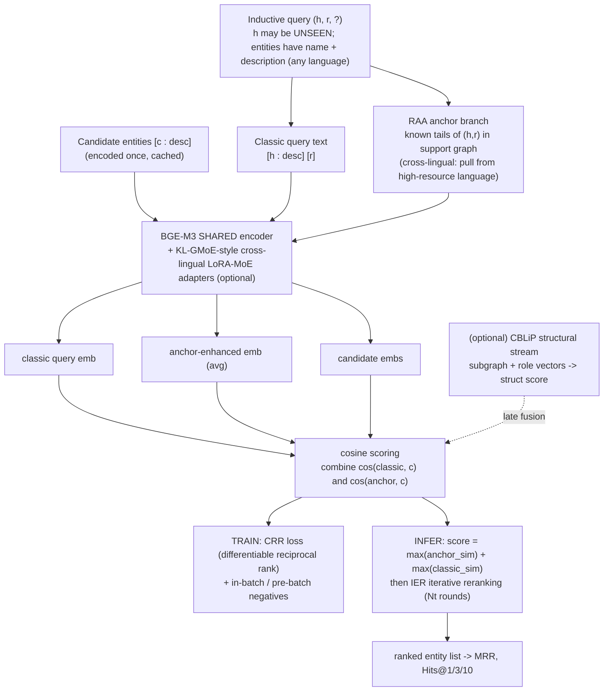

# Task 3; Unified Architecture Skeleton (Multilingual + Inductive KGC)

**Status:** draft 2026-06-23. Recommended design + the alternatives considered.
**Hard constraint:** runs on a single **RTX 5070 Ti 16 GB**, permanently. No large LLM reranker.

---

## 0. One re-roling decision up front (read this first)

The 21-June plan was "base = **CBLiP** + CRR + RAA". Task-2 research changed the base:

- RAA-KGC is **SimKGC-lineage** (text bi-encoder) -> it is **already inductive and already
  multilingual** (once the encoder is BGE-M3). It *is* a complete inductive backbone.
- CBLiP's value was "the inductive base", but that role is now filled by the text encoder. So
  CBLiP is **re-roled** from base to an **optional structural-signal stream** (late fusion),
  kept as an ablation to answer "does structure add anything on top of text?".

**Recommended base = BGE-M3 text bi-encoder.** CRR, RAA, IER, KL-GMoE-idea all attach to it;
CBLiP is a secondary stream. (Alternatives + why rejected: Section 9.)

---

## 1. Task & settings

**Task:** link prediction / tail (and head, via inverse relations) ranking. For `(h, r, ?)`
rank candidate entities; report MRR, Hits@1/3/10.

**Inductive:** test entities are unseen at train time. Each test entity is representable because
it carries **name + textual description** (text bi-encoder encodes it on the fly) and, in the
*inference/support graph*, may have a few observed edges (used for anchors + optional structure).

**Two evaluation settings (the paper's spine):**
1. **Monolingual inductive**; established inductive benchmark with text (Wikidata5M-Ind).
2. **Multilingual inductive**; inductive splits over **DBP-5L** (EN/FR/ES/JA/EL; Greek = the
   low-resource language). **No standard multilingual-inductive benchmark exists -> we construct
   one ("DBP-5L-Ind")** (a contribution in itself; mirrors the benchmark-building from the prior
   project). See Section 7 and `dataset_choice.md`.

---

## 2. Design principles (forced by 16 GB)

- Backbone <= ~600M params (BGE-M3); **shared encoder tower**; bf16 + gradient checkpointing +
  gradient accumulation for effective batch size.
- No component requires more than 16 GB at any single stage; the pipeline is **staged** (encode
  candidates once, cache embeddings; structure stream runs separately).
- Every added piece (RAA, CRR, KL-GMoE adapters, CBLiP) must be individually ablatable.

---

## 3. The architecture (recommended)

### 3.1 Core: BGE-M3 text bi-encoder (SimKGC/RAA style)
- **Query side (g1):** classic query text `[h : description] [relation]`.
- **Candidate side (g2 = SAME shared encoder):** `[candidate : description]`.
- **Score:** `s(h,r,c) = cos(emb_query, emb_cand)`. Candidate embeddings are encoded once and
  cached (cheap inductive inference).
- Inductive + multilingual for free: any-language descriptions map into BGE-M3's shared space.

### 3.2 RAA relation-aware anchors (Idea 3 lives here)
- **Anchor sourcing:** for `(h, r, ?)`, gather known tails of `(h, r)` from the available graph
  (train graph in transductive folds; **inference/support graph** in inductive folds). Sample up
  to k=5 as anchors.
  - **Inductive-safe fallback:** if h is brand-new with no observed `(h,r,.)` edges, fall back to
    **relation-level anchors** (typical/representative tails of r). [open: learned vs frequency]
  - **Cross-lingual anchors (Idea 3):** when the query language is low-resource, deliberately
    draw anchors from a **high-resource language** (e.g. EN) where `(h,r,.)` is denser; BGE-M3's
    cross-lingual alignment keeps them comparable. This is the headline cross-lingual lever.
- **Anchor-enhanced query embedding:** encode query + anchor descriptions; average the anchor
  embeddings (RAA's aggregation).
- **Inference combination (RAA):** `score = max(anchor_sim) + max(classic_sim)`.

### 3.3 CRR loss (Idea 2 lives here); the training objective
- Replace/augment InfoNCE with **CRR** (Combined Reciprocal Rank), the differentiable
  rank-approximation loss from KGCRR (sigmoid of score differences, temperature tau, pressure
  rho, nonlinear transform T). It is **plug-and-play on any scoring function**, so it applies
  directly to the bi-encoder's cosine scores over the in-batch candidate pool.
- Contribution = first test of CRR in a **multilingual** + **inductive** setting (KGCRR only ever
  used FB15k-237 / WN18RR, English, transductive).
- Negatives: in-batch + pre-batch negatives (SimKGC trick) for a large negative pool on 16 GB.
- **Ablation:** InfoNCE vs CRR vs InfoNCE+CRR.

### 3.4 KL-GMoE-style cross-lingual adapters (borrowed MKGC idea, lightweight)
- Instead of MKGC's 7B Llama, put the **grouped shared-A / expert-B LoRA-MoE** *idea* as small
  adapters on the **BGE-M3 encoder** (FFN layers), routed on the (h, r) representation, for
  cross-lingual **parameter-level** knowledge sharing. Tiny param cost (LoRA rank 4).
- **Ablation:** plain LoRA vs KL-GMoE-style grouped adapters. (Optional / stretch; only if the
  simpler model leaves cross-lingual gains on the table.)

### 3.5 IER inference-time reranking (borrowed MKGC trick, ~free)
- After scoring, run **Iterative Entity Reranking** (extract top, remove, re-insert, repeat for
  Nt rounds) to convert point-scores into a stronger ranked list. Composes on any scorer; pairs
  naturally with CRR (CRR trains the ranking; IER restructures it at inference).

### 3.6 CBLiP structural stream (optional, ablation only)
- CBLiP scores `(h, r, t)` from the k-hop subgraph (connection-biased attention + role vectors),
  inductive and lightweight.
- **Late fusion:** `final = lambda * text_score + (1 - lambda) * struct_score`.
- Kept to answer "does structural signal help beyond text?"; NOT core, so the paper still stands
  if it adds little.

---

## 4. Flow diagram

---

## 5. Novelty mapping (so the contribution is explicit)

| Idea (from notes) | Where it lives | Claim |
|---|---|---|
| Idea 1: Multilingual + Inductive | whole system + the constructed benchmark | first to study unseen entities described in an unseen language |
| Idea 2: CRR in multilingual | Section 3.3 | CRR loss, only ever English/transductive, now in multilingual + inductive |
| Idea 3: cross-lingual anchors | Section 3.2 | relation-aware anchors sourced from high-resource languages for low-resource queries |
| Engineering | 16 GB-native | competitive multilingual inductive KGC on commodity hardware (no LLM reranker) |

---

## 6. Training & inference summary
- **Train:** shared BGE-M3 (+ optional adapters); CRR loss over in-batch + pre-batch negatives;
  bf16 + grad-checkpoint + grad-accum. Encode entity text on the fly (inductive).
- **Infer:** cache candidate embeddings; RAA combined score; IER rerank; (optional) fuse CBLiP.

---

## 7. Data & evaluation plan
- **Monolingual inductive:** Wikidata5M-Ind (has text; SimKGC reports MRR 71.4 -> strong, known
  reference point).
- **Multilingual inductive (constructed = "DBP-5L-Ind"):** take **DBP-5L** (EN/FR/ES/JA/EL),
  augment with multilingual Wikipedia/DBpedia abstracts (descriptions), and build **entity-disjoint
  inductive splits** (hold out a set of entities as unseen; keep their descriptions + a few support
  edges). EL=Greek is the low-resource target; ~40% cross-lingual alignment links enable the
  cross-lingual anchors. Document the protocol; this benchmark is a contribution. See `dataset_choice.md`.
- **Metrics:** MRR, Hits@1/3/10 (filtered).
- **Baselines:** original RAA-KGC (BERT), SimKGC, a structure-only inductive model (CBLiP alone /
  GraIL-style), and multilingual references (ALIGNKGC; the MKGC/KL-GMoE paper where comparable).
- **Ablations:** text-only -> +RAA -> +CRR -> +KL-GMoE-adapters -> +CBLiP-fusion; InfoNCE vs CRR;
  cross-lingual anchors on/off; shared vs (deferred) unshared tower.

---

## 8. 16 GB feasibility check (per component)
| Component | Fits 16 GB? | How |
|---|---|---|
| BGE-M3 shared encoder FT | yes | bf16 + grad-checkpoint + grad-accum; LoRA if tight |
| RAA anchors | yes | extra forward passes on <=5 short anchor texts |
| CRR loss | yes | loss-only, negligible |
| KL-GMoE adapters | yes | LoRA rank 4, tiny |
| IER | yes | inference loop, no training memory |
| CBLiP stream | yes | small transformer over subgraphs, run separately |

---

## 9. Alternatives considered (and why rejected)
1. **CBLiP as base + text bolted on (the original 21-June plan).** Rejected: duplicates the
   inductive mechanism the text encoder already provides, and CBLiP doesn't carry cross-lingual
   signal, which is the harder half. Text-base is better motivated for multilingual.
2. **7B-LLM reranker (faithful MKGC reproduction).** Rejected: bs1 LoRA on 16 GB, too slow for a
   5-language reranker; the user fixed 16 GB permanently. Keep IER + KL-GMoE *idea* instead.
3. **Early/joint two-stream fusion (text+structure in one model).** Rejected for v1: heavier,
   harder to ablate and debug on 16 GB. Late fusion first; revisit only if structure clearly helps.

---

## 10. Open decisions (need your input before building)
1. ~~Multilingual dataset~~ **RESOLVED: DBP-5L** (EN/FR/ES/JA/EL; Greek low-resource; ~40% aligned;
   225K triples fits 16 GB; canonical benchmark -> comparable baselines). See `dataset_choice.md`.
2. **Is CBLiP in v1 at all, or strictly a later ablation?** (Lean: ship v1 text-only core first,
   add CBLiP as the first post-MVP ablation.)
3. **KL-GMoE adapters in v1 or stretch?** (Lean: stretch; prove plain-LoRA multilingual first.)
4. **Relation-level anchor fallback:** frequency-based vs learned. (Lean: frequency for v1.)

Related: [[../paper_recreations/MKGC_KL-GMoE_architecture.md]], [[RAA_encoder_modernization.md]].
