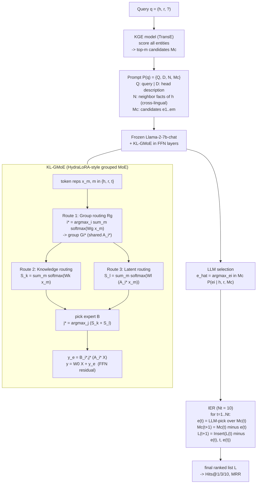

# MKGC via Efficient Multilingual Knowledge Sharing; Architecture Recreation

**Paper:** Multilingual Knowledge Graph Completion via Efficient Multilingual Knowledge Sharing
**Venue:** Findings of EMNLP 2025 (arXiv:2510.07736)
**Components:** KL-GMoE (Knowledge-Level Grouped Mixture of Experts) + IER (Iterative Entity Reranking)
**Base LLM:** Llama-2-7b-chat-hf, fine-tuned with LoRA (rank 4)

> Note vs the 19-June journal: the module is **KL-GMoE** (not "KHGMoE"). The 5-language
> dataset is a **custom extension of Wikidata5M** (EN/FR/IT/JA/ZH), not an off-the-shelf set.

---

## 1. What problem it targets

LLM-based MKGC underuses two things: (a) the LLM's own multilingual ability, and (b) the
*shareability* of knowledge across languages (a fact missing in one language often exists in
another). The paper names two concrete failure modes it is designed to fix:

1. **Knowledge overload vs knowledge fragmentation.** A single shared adapter (one channel)
   gets overloaded trying to hold all languages/relations; fully separate per-language adapters
   (multi-channel) fragment knowledge and lose what is shareable. KL-GMoE is the middle path.
2. **Paradigm discrepancy.** Vanilla LLM KGC *generates* a tail entity (free text), but KGC is
   evaluated as *ranking*. A single generated answer only gives you Hits@1. IER closes this gap
   by turning the LLM's pick into a full ranked list.

---

## 2. Overall pipeline (KGE retrieve -> LLM rerank)

The framework is a **two-stage retrieve-then-rerank** system, NOT end-to-end generation:

1. **KGE candidate retrieval.** A KGE model (TransE in the experiments) scores all entities for
   the query `q = (h, r, ?)` and returns the **top-m** candidates `Mc = [e_1, ..., e_m]`.
2. **LLM reranking.** The fine-tuned LLM (with KL-GMoE) selects the best candidate; IER then
   iterates that selection into a ranking.

### Prompt construction `P(q)` (adapted from DIFT)

For query `q = (h, r, ?)` the prompt has four parts:

| Symbol | Content |
|--------|---------|
| `Q`  | the query itself (h, r, ?) |
| `D`  | textual **description** of the head entity h |
| `N`  | **neighbor facts**: triples containing h, sampled from KGE training data (this is the cross-lingual sharing channel at the data level; neighbor facts can come from other languages) |
| `Mc` | the **candidate entities** `[e_1, ..., e_m]` from the KGE top-m |

The LLM is asked to **select** (rank), not to generate freely:

```
e_hat = argmax_{e_i in Mc} P(e_i | h, r, Mc)
```

> Detail: prompt examples are drawn from a **validation subset**, not the KGE's own training
> data, to avoid inheriting the KGE's training-data ranking bias.

---

## 3. KL-GMoE (the parameter-level knowledge-sharing module)

KL-GMoE is an **asymmetric-LoRA MoE** inserted into the LLM's **FFN layers**, built on the
HydraLoRA idea (one shared down-projection `A`, many up-projections `B` as experts) and
**generalized to groups**.

### 3.1 Grouped expert structure

- There are `Ng` **groups**. Group `i` owns one **shared A-matrix** `A_i` plus a set of
  **B-matrices** `{B_{i,j} : j = 1..Nb}`.
- An **expert** is a pair `E_{i,j} = (A_i, B_{i,j})`. So total experts = `Ng x Nb`.
- Intuition: `A_i` captures a **similar knowledge category** (shared across the group / across
  languages); each `B_{i,j}` captures the **subtle differences** within that category.

```
G_i = ( A_i , { B_{i,j} | j in 1..Nb } ),   i in 1..Ng
```

### 3.2 Knowledge-Level routing (three routes)

Routing is computed from the **(h, r, t) token representations** `x_m, m in {h, r, t}`; this
is what "knowledge-level" means: route at the granularity of the **triple's knowledge**, not
per individual token.

**Route 1; Group routing `Rg`** picks which group (which shared `A_i`):
```
i* = argmax_i ( sum_{m in {h,r,t}} Softmax(Wg x_m) )
```

**Route 2; Knowledge-based routing `Rk`** scores B-experts from raw token reps:
```
S_k = sum_{m in {h,r,t}} Softmax(Wk x_m)
```

**Route 3; Latent-based routing `Rl`** scores B-experts from the **down-projected latent**
(uses the chosen group's `A_i`):
```
S_l = sum_{m in {h,r,t}} Softmax(Wl (A_i* x_m))
```

**Selected expert** within the chosen group combines both scores:
```
j* = argmax_j ( S_k + S_l )      ->   expert B_{i*, j*}
```

### 3.3 Integration into the FFN

The KL-GMoE output is added as a **residual** on top of the frozen FFN output:
```
y_e = B_{i*, j*} ( A_{i*} X )
y   = W0 X + y_e
```
Only the **activated** expert's parameters are used per sample (sparse). LoRA rank = 4. The
base weights `W0` stay frozen; only `A_i`, `B_{i,j}`, and the router matrices `Wg, Wk, Wl` train.

> The paper reports standard supervised fine-tuning on the selection task; no explicit
> load-balancing loss is described (worth flagging; most MoE work adds one, so this is a
> candidate ablation if we adapt it).

---

## 4. IER (Iterative Entity Reranking)

A single `argmax` only yields the top-1 entity, so it cannot produce Hits@3/Hits@10/MRR. IER
extracts the top entity, removes it, and repeats; building a ranked prefix of length `Nt`.

For `t = 1 .. Nt` (with `Nt = 10`):
```
e(t)     = argmax_{e_i in Mc(t)} P(e_i | h, r, Mc(t))     # LLM picks current best
Mc(t+1)  = Mc(t) \ { e(t) }                                # remove it from candidates
L(t+1)   = Insert( L(t) \ { e(t) }, t, e(t) )              # place it at rank t in the list
```

- `Insert(list, pos, e)` removes `e` then re-inserts it at position `pos`.
- After `Nt` rounds you have a fully ranked top-`Nt`; the remaining candidates keep their KGE
  order below. **No early stopping**; fixed `Nt = 10`.
- **Training trick:** the candidate-list size `m` is randomized in **[25, 30]** during training
  so the model learns to rank under varying list lengths (needed for the iterative behavior).

---

## 5. Data, metrics, results

**Dataset:** Wikidata5M extended to 5 languages.

| | EN | FR | IT | JA | ZH |
|---|---|---|---|---|---|
| train triples | 708,267 | 839,623 | 613,014 | 321,237 | 546,626 |

Totals: 351,299 entities, 2,264 relations, 3,028,767 triples.

**Metrics:** Hits@1, Hits@3, Hits@10, MRR.

**Headline results (averages):** H@1 = 41.88, H@3 = 50.93, H@10 = 58.78, MRR = 47.86.
**vs prior SOTA GC-PLM:** +5.47 H@1, +3.27 H@3, +1.01 H@10, +6.13 MRR.

**Training:** LR 2e-5, LoRA rank 4, candidate length 25-30, IER iterations 10. (Epochs/hardware
not stated in the HTML; pull from the PDF/appendix when implementing.)

---

## 6. Flowchart



---

## 7. How this slots into OUR direction (Multilingual + Inductive)

Our planned system is **CBLiP base + CRR loss + RAA anchors**, in monolingual-inductive and
multilingual-inductive settings. Reuse / adapt notes:

- **KL-GMoE is a fine-tuning adapter, base-model-agnostic in spirit.** It targets FFN layers of
  a decoder LLM. Our base is CBLiP (a transformer encoder over subgraphs), so KL-GMoE would
  need re-targeting to CBLiP's attention/FFN blocks if we want its cross-lingual parameter
  sharing. The *grouped shared-A / expert-B* factorization is the transferable idea.
- **IER is purely a reranking wrapper** over any model that can score candidates; it composes
  cleanly with CRR (CRR optimizes the ranking objective during training; IER restructures the
  ranked list at inference). Low-risk to adopt directly.
- **Inductive gap:** this paper is **transductive** (entities are seen, KGE-embedded). Its KGE
  retrieval stage assumes learned entity embeddings, which break for unseen entities. For our
  inductive setting we'd replace the KGE retriever with CBLiP's inductive scoring (subgraph +
  entity-role) and keep IER on top. This is exactly the "transductive trick in an inductive
  setting" tension our narrative is built around.
- **Cross-lingual sharing happens at two levels here:** data-level (neighbor facts `N` pulled
  across languages) and parameter-level (shared `A_i`). Both are levers we can keep.

**Open items to confirm from the PDF:** `Ng` / `Nb` values, exact baseline list beyond GC-PLM,
epochs/hardware, whether neighbor facts `N` are explicitly cross-lingual, and any load-balancing.
